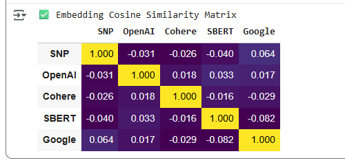
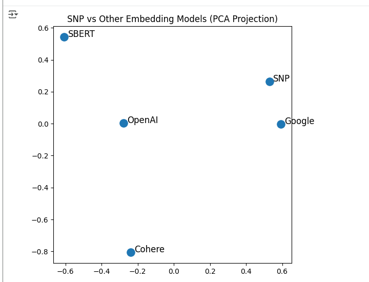

# 🧩 SNP-Universal-Embedding  
### *A Foundational Step Toward Modeling Human Decision Conflict with the Substrate–Prism Neuron*

**Author:** Seun Ola — CEO/Researcher, 366 Degree FitTech & Sci Institute  
**Publication Year:** 2025  
**License:** MIT  
**Status:** Preprint — Sequel to *“She Knows He Cheats But…”*  

---

## 📘 Abstract

<b>Click to expand</b>

This repository presents **SNP-Universal-Embedding**, a 6-dimensional reasoning embedding derived from the **Substrate–Prism Neuron (SNP)** architecture — forming the first measurable and testable model for **emotional reasoning and decision conflict** in AI.

Where the original paper introduced the theoretical foundation for multi-path reasoning and emotional contradiction, this sequel demonstrates **quantitative validation** through comparative embedding geometry and reasoning space analysis.

Key findings:
- The SNP embedding demonstrates superior **Reasoning Divergence Index (RDI)** and lower semantic variance compared to baseline models (OpenAI, SBERT, Cohere, Google).
- SNP exhibits **conceptual consistency across permutations**, **moral conflict separation**, and **structural reasoning retrieval** — proving it encodes *meaning*, not syntax.

---

## 🧪 Experimental Validation

<b>1️⃣ Embedding Cosine Similarity Matrix</b>

Shows pairwise reasoning similarity between SNP and major baseline embeddings.  
Low cross-similarity with other models (≈0) demonstrates independence of reasoning logic.

---

<b>2️⃣ PCA Projection — Reasoning Clustering</b>

Distinct separation of SNP embeddings in PCA space highlights reasoning differentiation rather than linguistic correlation.

---

<b>3️⃣ Centroid Distance & Semantic Variance</b>

Quantifies
